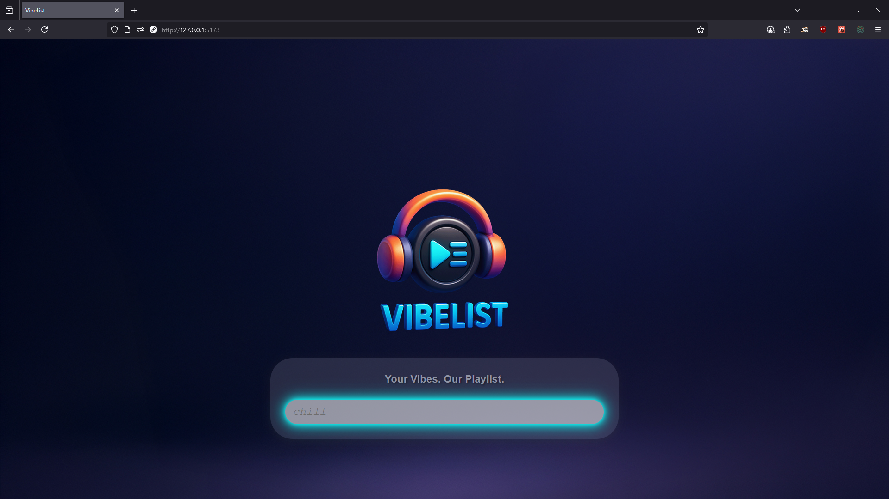

# VibeList

*Using AI to generate good vibes!*

A lightweight web app that takes your vibes (moods, themes, prompts) and turn them into playlists / recommendations using AI.

## Screenshots/Demo



## Features

Prompt → Vibe: Enter a mood or theme and using AI, we will generate a list of 40 curated songs that match that vibe!

Refresh: You can choose to refresh all 40 songs or 1 song at a time! The songs will not be the same songs that were on the list previously. 

Save to Spotify: If you like the song recommendations, you can click the button at the bottom of the playlist page to get spotify song URIs! *Due to Spotify API limiations, these URI links will be individual song links stored as an array of strings.*

## Tech stack

Frontend: Vite + JavaScript, React, HTML, CSS

Server: Node.js, Express

AI: OpenAI 4.o

## Project structure
```
VibeList/
├─ src/                # Frontend source (components, utilities, state)
├─ server/             # Small backend for API calls/secrets
├─ index.html          # App entry HTML (Vite)
├─ styles.css          # Global styles
├─ vite.config.js      # Vite configuration
├─ package.json        # Scripts & dependencies
└─ log.md              # Dev AI logs
```

## Getting started

### Prerequisites

Node.js ≥ 18

npm (or pnpm/yarn)

1) Clone and install

git clone https://github.com/TeamTweety/VibeList.git
cd VibeList
npm install

2) Configure environment

Create a .env file in the project root and add any required keys:

### Server
AI Provider = OpenAi 4.o

```
OPENAI_API_KEY="sk-..."         
SPOTIFY_CLIENT_ID="..."
SPOTIFY_CLIENT_SECRET="..."
```

3) Run locally

In two terminals (or use a single command if you have a concurrent script):

### Terminal A — start the server
```
npm run conc
```
Open the app at the printed dev URL (commonly http://localhost:5173).


## Development notes

LLM calls: Be careful of too many calls.

Spotify API: We currently do not support spotify account login. That means that users will be rate limited based on their Spotify client ID


## Contributing

Contributions are welcome! Please:

Open an issue describing the change.

Fork the repo and create a feature branch.

Submit a PR with a clear description and screenshots if UI changes.